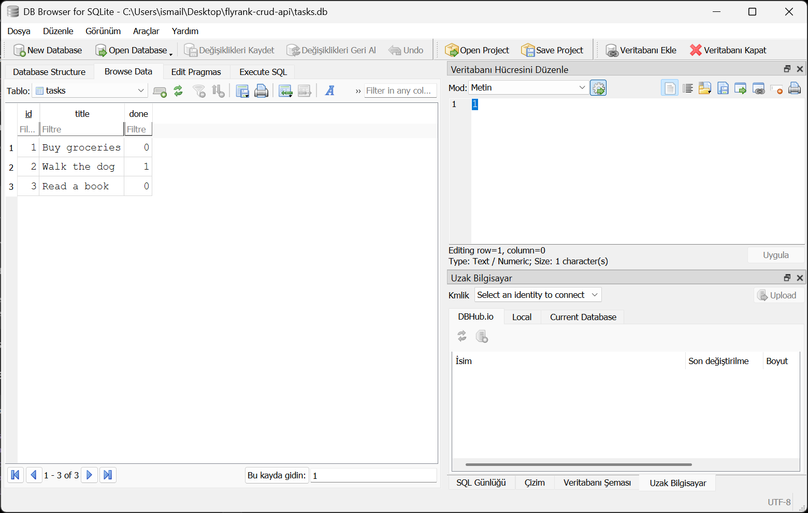

# Task API

A SQLite-backed CRUD API for managing a persistent to-do list.

The project was built with Node.js and Express as part of the FlyRank Backend AI Engineering internship assignment.

## Features

- Create a new task
- List all tasks
- Get a task by ID
- Update a task
- Delete a task
- JSON input validation
- Correct HTTP status codes
- Interactive Swagger UI documentation
- Persistent SQLite data storage
- Automatically created database and table
- Three example tasks seeded when the database is empty
- Parameterized SQL queries
- Data that survives server restarts

## Technologies

- Node.js
- Express
- SQLite
- better-sqlite3
- Swagger UI
- OpenAPI 3.0

## Installation

Clone the repository:

```bash
git clone https://github.com/ismailozer/flyrank-crud-api.git
```

Open the project directory:

```bash
cd flyrank-crud-api
```

Install the dependencies:

```bash
npm install
```
No separate SQLite installation or database setup is required. The application
creates `tasks.db` and the `tasks` table automatically when it starts.

## Running the API

Start the server with:

```bash
npm start
```

The API runs at:

```text
http://localhost:3000
```

Swagger UI is available at:

```text
http://localhost:3000/docs
```

## Task structure

Each task has the following structure:

```json
{
  "id": 1,
  "title": "Buy groceries",
  "done": false
}
```

## Endpoints

| Method | Endpoint | Description | Success status |
|---|---|---|---:|
| GET | `/` | Returns information about the API | 200 |
| GET | `/health` | Checks whether the server is running | 200 |
| GET | `/tasks` | Returns all tasks | 200 |
| GET | `/tasks/:id` | Returns one task by ID | 200 |
| POST | `/tasks` | Creates a new task | 201 |
| PUT | `/tasks/:id` | Updates a task | 200 |
| DELETE | `/tasks/:id` | Deletes a task | 204 |

## Create a task

Request:

```bash
curl -X POST http://localhost:3000/tasks \
  -H "Content-Type: application/json" \
  -d "{\"title\":\"Buy milk\"}"
```

Request body:

```json
{
  "title": "Buy milk"
}
```

Example response:

```json
{
  "id": 4,
  "title": "Buy milk",
  "done": false
}
```

## Update a task

Request body:

```json
{
  "title": "Buy oat milk",
  "done": true
}
```

Example request:

```bash
curl -X PUT http://localhost:3000/tasks/4 \
  -H "Content-Type: application/json" \
  -d "{\"title\":\"Buy oat milk\",\"done\":true}"
```

## Example curl output

The following output was produced by:

```bash
curl -i http://localhost:3000/tasks/1
```

```text
HTTP/1.1 200 OK
X-Powered-By: Express
Content-Type: application/json; charset=utf-8
Content-Length: 45
ETag: W/"2d-Gv8HDdZD1sn+UqMseo56OTgQmek"
Date: Thu, 06 Aug 2026 21:55:06 GMT
Connection: keep-alive
Keep-Alive: timeout=5

{"id":1,"title":"Buy groceries","done":false}
```

## Validation and error responses

Creating a task without a valid title returns `400 Bad Request`:

```json
{
  "error": "title is required and cannot be empty"
}
```

Requesting an unknown task returns `404 Not Found`:

```json
{
  "error": "Task 99 not found"
}
```

Sending an invalid `done` value during an update returns `400 Bad Request`:

```json
{
  "error": "done must be a boolean"
}
```

## Swagger UI

The API can be tested interactively through Swagger UI:

```text
http://localhost:3000/docs
```


## SQLite database

The application stores tasks in a SQLite database instead of an in-memory
array.

SQLite was chosen because it requires no separate database server, stores the
entire database in a single file, requires almost no setup and preserves data
when the Node.js server restarts.

The database file is created automatically at:

```text
tasks.db
```

The `tasks.db` file is ignored by Git. When someone clones the repository and
starts the project, the application automatically creates a fresh database,
creates the `tasks` table and inserts three example tasks if the table is
empty.

The table has the following columns:

| Column | SQLite type | Description |
|---|---|---|
| `id` | INTEGER | Primary key for each task |
| `title` | TEXT | Task description |
| `done` | INTEGER | Completion status stored as `0` or `1` |

In the API response, SQLite's `0` and `1` values are converted to JSON
booleans `false` and `true`.

## Persistence

Tasks are stored on disk inside `tasks.db`.

A task created through `POST /tasks` remains available after stopping and
restarting the server. The API endpoints and response shapes remain the same;
only the storage layer changed from an array in memory to SQLite.

This demonstrates that the database is an implementation detail behind the
API.

## Database screenshot

The following screenshot shows the `tasks` table opened in DB Browser for
SQLite:



## SQL exploration

I opened `tasks.db` in DB Browser for SQLite and executed SQL queries manually.

Example query:

```sql
SELECT * FROM tasks
WHERE done = 1;
```

This query returned only completed tasks whose `done` value was stored as `1`.

Other queries and observations are documented in
[`sql-exploration.md`](./sql-exploration.md).

## HTTP status codes

| Status | Meaning |
|---:|---|
| 200 | Request completed successfully |
| 201 | A new task was created |
| 204 | A task was deleted successfully |
| 400 | The request body was invalid |
| 404 | The requested task was not found |

## PostgreSQL development container

PostgreSQL can be started manually for development with:

```bash
docker run --name taskdb \
  -e POSTGRES_PASSWORD=dev \
  -e POSTGRES_DB=tasks \
  -p 5432:5432 \
  -v taskdata:/var/lib/postgresql/data \
  -d postgres
```

The database runs at `localhost:5432`.

The named Docker volume `taskdata` stores the PostgreSQL data outside the
container so that rows can survive container restarts.

The application is not connected to PostgreSQL yet. The connection and table
setup are implemented in the next stage.