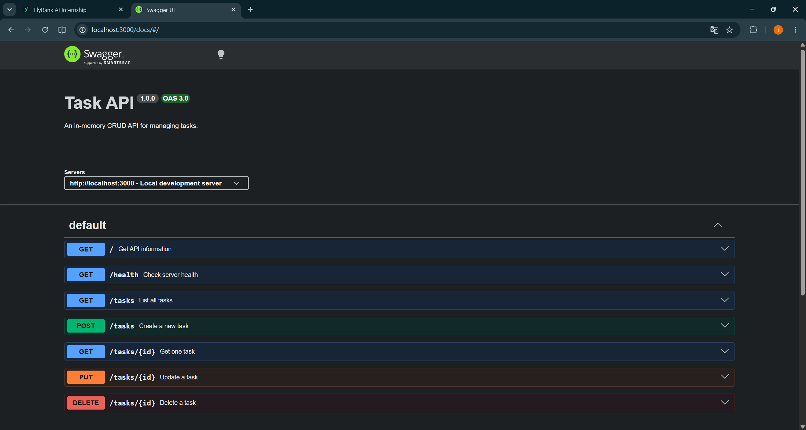

# Task API

A simple in-memory CRUD API for managing a to-do list.

The project was built with Node.js and Express as part of the FlyRank Backend AI Engineering internship assignment.

## Features

- Create a new task
- List all tasks
- Get a task by ID
- Update a task
- Delete a task
- JSON input validation
- Correct HTTP status codes
- Interactive Swagger UI documentation
- In-memory data storage

## Technologies

- Node.js
- Express
- Swagger UI
- OpenAPI 3.0

## Installation

Clone the repository:

```bash
git clone https://github.com/ismailozer/flyrank-crud-api.git
```

Open the project directory:

```bash
cd flyrank-crud-api
```

Install the dependencies:

```bash
npm install
```

## Running the API

Start the server with:

```bash
npm start
```

The API runs at:

```text
http://localhost:3000
```

Swagger UI is available at:

```text
http://localhost:3000/docs
```

## Task structure

Each task has the following structure:

```json
{
  "id": 1,
  "title": "Buy groceries",
  "done": false
}
```

## Endpoints

| Method | Endpoint | Description | Success status |
|---|---|---|---:|
| GET | `/` | Returns information about the API | 200 |
| GET | `/health` | Checks whether the server is running | 200 |
| GET | `/tasks` | Returns all tasks | 200 |
| GET | `/tasks/:id` | Returns one task by ID | 200 |
| POST | `/tasks` | Creates a new task | 201 |
| PUT | `/tasks/:id` | Updates a task | 200 |
| DELETE | `/tasks/:id` | Deletes a task | 204 |

## Create a task

Request:

```bash
curl -X POST http://localhost:3000/tasks \
  -H "Content-Type: application/json" \
  -d "{\"title\":\"Buy milk\"}"
```

Request body:

```json
{
  "title": "Buy milk"
}
```

Example response:

```json
{
  "id": 4,
  "title": "Buy milk",
  "done": false
}
```

## Update a task

Request body:

```json
{
  "title": "Buy oat milk",
  "done": true
}
```

Example request:

```bash
curl -X PUT http://localhost:3000/tasks/4 \
  -H "Content-Type: application/json" \
  -d "{\"title\":\"Buy oat milk\",\"done\":true}"
```

## Example curl output

The following output was produced by:

```bash
curl -i http://localhost:3000/tasks/1
```

```text
HTTP/1.1 200 OK
X-Powered-By: Express
Content-Type: application/json; charset=utf-8
Content-Length: 45
ETag: W/"2d-Gv8HDdZD1sn+UqMseo56OTgQmek"
Date: Thu, 06 Aug 2026 21:55:06 GMT
Connection: keep-alive
Keep-Alive: timeout=5

{"id":1,"title":"Buy groceries","done":false}
```

## Validation and error responses

Creating a task without a valid title returns `400 Bad Request`:

```json
{
  "error": "title is required and cannot be empty"
}
```

Requesting an unknown task returns `404 Not Found`:

```json
{
  "error": "Task 99 not found"
}
```

Sending an invalid `done` value during an update returns `400 Bad Request`:

```json
{
  "error": "done must be a boolean"
}
```

## Swagger UI

The API can be tested interactively through Swagger UI:

```text
http://localhost:3000/docs
```



## In-memory storage

The tasks are stored in an array in the application's memory.

When the server is restarted, tasks created, updated, or deleted during the previous session are lost. The original three example tasks are loaded again because no database or persistent file storage is used.

## HTTP status codes

| Status | Meaning |
|---:|---|
| 200 | Request completed successfully |
| 201 | A new task was created |
| 204 | A task was deleted successfully |
| 400 | The request body was invalid |
| 404 | The requested task was not found |